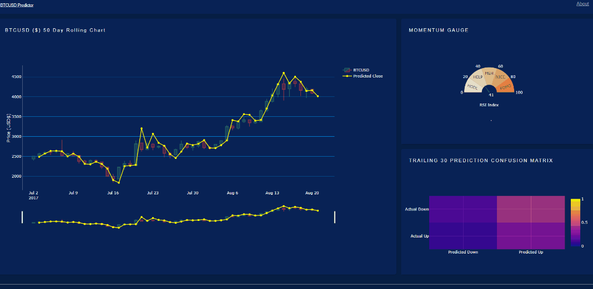

# BTCDash: A Bitcoin Price Prediction Dashboard

[**Website**](https://dry-shore-97069.herokuapp.com/)

*BTCDash* is a Bitcoin price prediction dashboard showcasing pseudo-real time prediction of 
the next period Bitcoin prices denominated in USD. 

Included on the dashboard are a 50 day
BTCUSD OHLC chart with predicted price overlay line, a momentum gauge that displays the fear
and greed using Relative Strength Indicator, and directional prediction accuracy over the 
last 30 periods.ically construct the search spaces for the hyperparameters.

## Key Features

BTCDash includes a real time pseudo live prediction update chart as follows:

- BTCUSD OHLC chart with predicted price overlay
- Momentum gauge using Relative Strength Indicator
- Directional prediction confusion metrics

